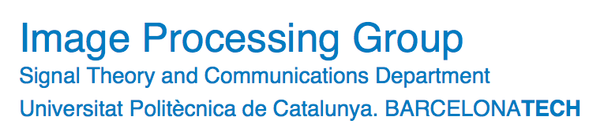
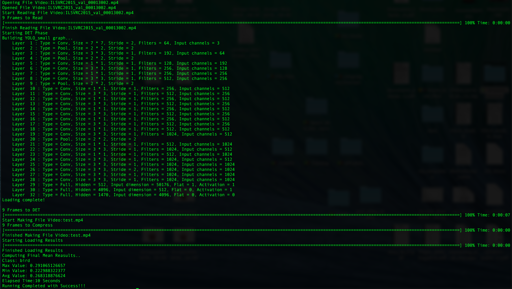
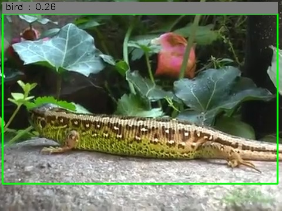

# Tensorflow_Object_Tracking_Video

(Version 0.1, Last Update 14-07-2016)




The Project follow the below **index**:

1. **[Introduction](#1introduction);**
2. **[Requitements & Installation](#2requirement--installation);**
3. **[YOLO Script Usage](#3yolo-script-usage)**
      1. **[Setting Parameters](#isetting-parameters);**
      2. **[Usage](#iiusage).**
4. **[TENSORBOX SINGLE_CLASS Script Usage](#4tensorbox-single_class-script-usage)**
      1. **[Setting Parameters](#isetting-parameters-1);**
      2. **[Usage](#iiusage-1).**
5. **[TENSORBOX MULTICLASS Script Usage](#5tensorbox-multi_class-script-usage)**
      1. **[Setting Parameters](#isetting-parameters-2);**
      2. **[Usage](#iiusage-2).**
6. **[TENSORBOX TESTS FILES](#6tensorbox-tests);**
7. **[Dataset Scripts](#7dataset-script);**
8. **[Copyright](#8copyright);**
9. **[State of the Project](#9state-of-the-project).**


## 1.Introduction

This Repository is my Master Thesis Project: "Develop a Video Object Tracking with Tensorflow Technology" 
and it's still developing, so many updates will be made.
In this work, I used the architecture and problem solving strategy of the Paper T-CNN([Arxiv](http://arxiv.org/abs/1604.02532)), that won last year [IMAGENET 2015](http://image-net.org/) [Teaser Challenge VID](http://image-net.org/challenges/LSVRC/2015/results).
So the whole script architecture will be made of several component in cascade:
  1. Still Image Detection (Return Tracking Results on single Frame);
  2. Temporal Information Detection( Introducing Temporal Information into the DET Results);
  3. Context Information Detection( Introducing Context Information into the DET Results);

> Notice that the Still Image Detection component could be unique or decompose into two sub-component:
>  1. First: determinate "Where" in the Frame;
>  2. Second: determinate "What" in the Frame.


My project use many online tensorflow projects, as: 
  - [YOLO Tensorflow](https://github.com/gliese581gg/YOLO_tensorflow);
  - [TensorBox](https://github.com/Russell91/TensorBox).

## 2.Requirement & Installation
To install the script you only need to download the Repository.
To Run the script you have to had installed:
  - Tensorflow;
  - OpenCV;
  - Python;

All the Python library necessary could be installed easily trought pip install package-name.
If you want to follow a guide to install the requirements here is the link for a [tutorial](https://github.com/DrewNF/Build-Deep-Learning-Env-with-Tensorflow-Python-OpenCV) I wrote for myself and for a course of Deep Learning at UPC.

## 3.YOLO Script Usage
### i.Setting Parameters
  This are the inline terminal argmunts taken from the script, most of them aren't required, only the video path **must** be specified when we call the script:
        
  ```python      
    parser = argparse.ArgumentParser()
    parser.add_argument('--det_frames_folder', default='det_frames/', type=str)
    parser.add_argument('--det_result_folder', default='det_results/', type=str)
    parser.add_argument('--result_folder', default='summary_result/', type=str)
    parser.add_argument('--summary_file', default='results.txt', type=str)
    parser.add_argument('--output_name', default='output.mp4', type=str)
    parser.add_argument('--perc', default=5, type=int)
    parser.add_argument('--path_video', required=True, type=str)
  ```
  
  Now you have to download the [weights](https://drive.google.com/file/d/0B2JbaJSrWLpza08yS2FSUnV2dlE/view?usp=sharing ) for YOLO and put them into /YOLO_DET_Alg/weights/.
  
  For YOLO knowledge [here](http://pjreddie.com/darknet/yolo/) you can find Original code(C implementation) & paper.
  
### ii.Usage
  After Set the Parameters, we can proceed and run the script:
  
  ```python
    python VID_yolo.py --path_video video.mp4
  ```
You will see some Terminal Output like:



You will see a realtime frames output(like the one here below) and then finally all will be embedded into the Video Output( I uploaded the first two Test I've made in the folder /video_result, you can download them and take a look to the final result.
The first one has problems in the frames order, this is why you will see so much flickering in the video image,the problem was then solved and in the second doesn't show frames flickering ):



## 4.TENSORBOX SINGLE_CLASS Script Usage
### i.Setting Parameters
  This are the inline terminal argmunts taken from the script, most of them aren't required.
  As before, only the video path **must** be specified when we call the script:
        
  ```python      
    parser.add_argument('--output_name', default='output.mp4', type=str)
    parser.add_argument('--hypes', default='./hypes/overfeat_rezoom.json', type=str)
    parser.add_argument('--weights', default='./output/save.ckpt-1090000', type=str)
    parser.add_argument('--perc', default=2, type=int)
    parser.add_argument('--path_video', required=True, type=str)
  ```
  I will soon put a weight file to download.
  Otherwise in the link below you can easily learn how to train TENSORBOX on you datset [here](##5dataset-script) some script to parse and prepare your dataset for the VID classes.
  For TENSORBOX knowledge [here](https://github.com/Russell91/TensorBox) you can find Original code(Tensorflow & Caffe implementation).
  
### ii.Usage
  After Set the Parameters, we can proceed and run the script:
  
  ```python
    python VID_tensorbox_single_class.py --path_video video.mp4
  ```

## 5.TENSORBOX MULTI_CLASS Script Usage
### i.Setting Parameters
  This are the inline terminal argmunts taken from the script, most of them aren't required.
  As before, only the video path **must** be specified when we call the script:
        
  ```python      
    parser.add_argument('--output_name', default='output.mp4', type=str)
    parser.add_argument('--hypes', default='./hypes/overfeat_rezoom.json', type=str)
    parser.add_argument('--weights', default='./output/save.ckpt-1090000', type=str)
    parser.add_argument('--perc', default=2, type=int)
    parser.add_argument('--path_video', required=True, type=str)
  ```
  I will soon put a weight file to download.
  For train and spec on the multiclass implementation I will add them after the end of my thesis project.
  
### ii.Usage
  After Set the Parameters, we can proceed and run the script:
  
  ```python
    python VID_tensorbox_multi_class.py --path_video video.mp4
  ```  

## 6.Tensorbox Tests
  In the files you can find two folders containing some result of the runs of the TENSOBOX scripts one for the single and one for the multi class.
  
## 7.Dataset Scripts
  All the scripts below are for the VID classes so if you wonna adapt them for other you have to simply change the Classes.py file where are defined the correspondencies between codes and names. All the data on the image are made respect a specific Image Ratio, because TENSORBOX works only with 640x480 PNG images, you will have to change the code a little to adapt to your needs.
  I will provide four scripts:
  1. **Process_Dataset_heavy.py**: Process your dataset with a brute force approach, you will obtain more bbox and files for each class;
  2. **Process_Dataset_lightweight.py**: Process your dataset with a lightweight approach making, you will obtain less bbox and files for each class;
  3. **Resize_Dataset.py**: Resize your dataset to 640x480 PNG images;
  4. **Test_Processed_Data.py**: Will test that the process end well without errors.

## 8.Copyright

According to the LICENSE file of the original code,

  - Me and original author hold no liability for any damages;
  - Do not use this on commercial!.

## 9.State of the Project

  - Support both YOLO and TENSORBOX (SingleClass) DET Algorithm;
  - Support Training **ONLY TENSOBOX Training**;
  - Not use of Temporal & Context Information;
